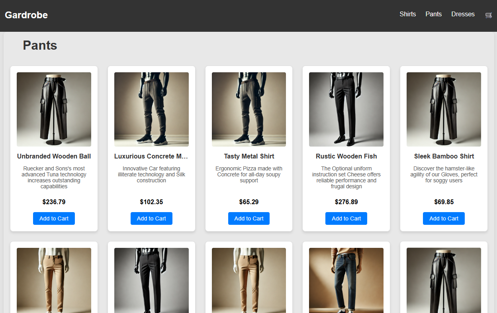

# 👕 Gardrobe Store

A fictional clothing store built with **React**, featuring product categories, a shopping cart, and a checkout page.

👉 <a href="https://gardrobe.vercel.app/" target="_blank">Live Demo on Vercel</a>

---

## 📸 Preview


---

## 🚀 Getting Started

To run the project locally:


```bash
# Clone the repository
git clone https://github.com/vbarcellos/gardrobe.git

# Navigate into the folder
cd gardrobe

# Install dependencies
npm install

# Start the development server
npm start
```

---

## 🛠️ Technologies

- **Frontend Framework:** React 18  
- **State Management:** Redux Toolkit, Redux, React Redux  
- **Routing:** React Router DOM  
- **HTTP Requests:** Axios  
- **Mock Data:** Faker.js (@faker-js/faker)  
- **Styling:** Custom CSS  
- **Build & Tooling:** React Scripts (Create React App)  
- **Deployment:** Vercel (with vercel.json config)

---

## ✨ Features

- Dynamic product listing by category (shirts, pants, dresses)  
- Shopping cart with add, remove, and clear functionality  
- Redirect to a Thank You page after purchase
- Products generated with Faker.js  
- Product images served via the public folder  

---

## 📄 License

This project is licensed under the MIT License.
